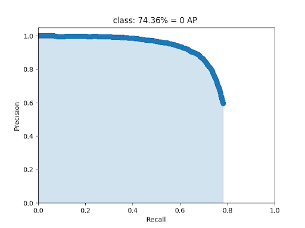
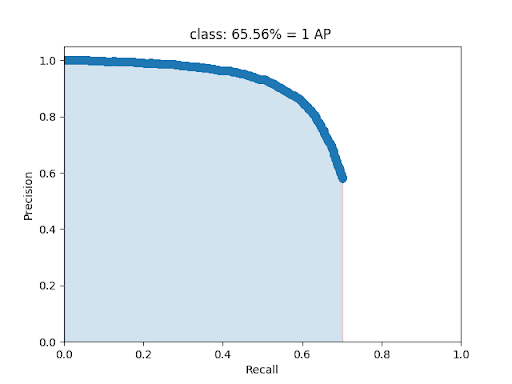
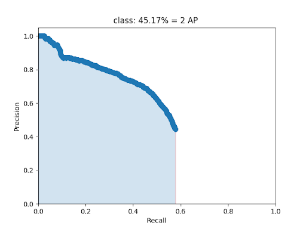
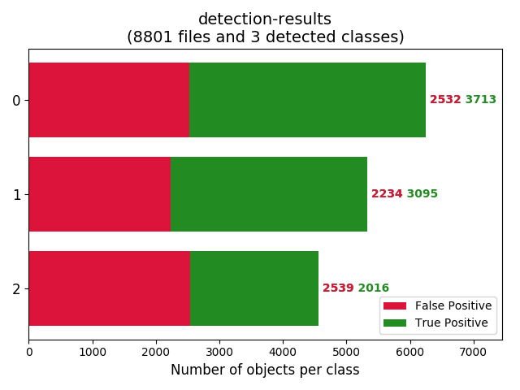
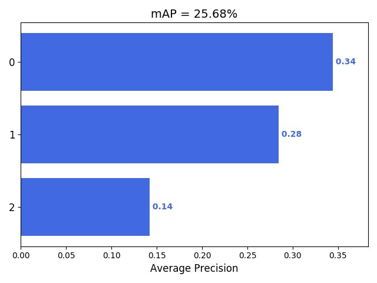

## Training Schedule - 

#### Dataset/Job - ods_job_120619

#### Labels - 3 ['signage', 'traffic_sign', 'traffic_light']

#### Training Images - 20,283
  
#### Click [here](/YoloV3/README.md) to see training procedure. 

## Evaluation-

#### Test Dataset/Job - ods_job_120619

#### Test Images - 8,801

#### Average Prediction Time = 0.035s

#### Evaluation metric - [mAP](https://github.com/Cartucho/mAP). 
Refer the above GitHub repo for code for mAP calculation.

## Statistics -

_At IoU threshold = 0.5_

     **signage**
     **traffic-sign**
     **traffic-light**

**TP and FP count at 0.5 IoU**

_Precision-Recall curve for different IoU values_
 **signage**
 **traffic_sign**
 **traffic_light**

_mAP(average over different IoU values)

