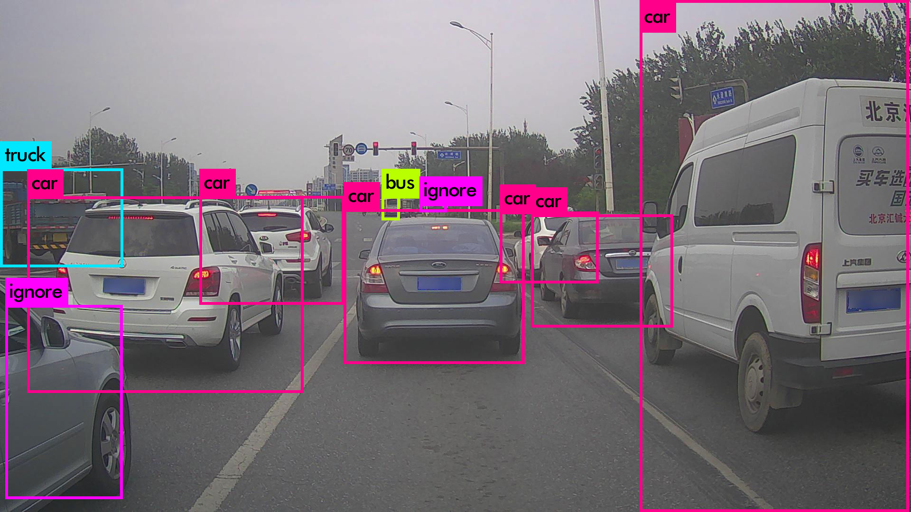

### YOLOv3 (You only look once)

YOLOv3 is an updated version of the original YOLO.
Easy implementation of the pre-trained model can be  found on [https://pjreddie.com/darknet/yolo/](https://pjreddie.com/darknet/yolo/). Also, easy steps to train it on selected datasets are given on the website. 

- [YOLO](YOLO.pdf) and [YOLOv3](YOLOv3.pdf) papers.

- I forked the original repository, darknet, having c++ implementation and all the necessary files for the implementation of pre-trained model - [GuptaAbhinavv/darknet](https://github.com/GuptaAbhinavv/darknet)

- Implementation of YOLOv3 using OpenCV in python based on [this](https://www.learnopencv.com/deep-learning-based-object-detection-using-yolov3-with-opencv-python-c/).
Usage-
###### Getting weights-
      sudo chmod a+x getModel.sh
      ./getModel.sh
###### Running code- 
     python3 yolo_objD.py --image=bird.jpg (For image)
     
     python3 yolo_objD.py --video=run.mp4 (For video)

- Training YOLOv3 on custom data - [Snowman Detector](https://www.learnopencv.com/training-yolov3-deep-learning-based-custom-object-detector/)

- Training YOLOv3 on custom data - Obstacle Detection([Apollo.auto](http://data.apollo.auto/help?name=data-2d-obstacle-intro&data_key=2d_obstacle_label&data_type=0&locale=en-us&lang=en)). 
Follow a few steps to train YOLO on any dataset-

      - Make sure all of your images, training and testing images rside in a directory called "JPEGImages".
      - Similarly, the labels lie in a directory named "labels" with names same as corresponding image.
      - In the configuration(.cfg) file, if commented, uncomment the 6, 7 line and set batch size and subdivisions appropriately.
      - Search for the [yolo] layer. Edit number of classes in each [yolo] layer.
      - Also, change filter value in the [convolution] above [yolo] to #anchors*(5 + #of classes)
  
- Sample Apollo Obstacle Detection dataset and corresponding files - [here](ObstacleDetection_Apollo/). To train on this dataset-

      - Change the .data file values and edit test, train files according to your folder structure.
      - Make an empty directory "weights" to store the weights.
      - Run : ./darknet detector train path/to/data/file/darknet.data path/to/cfg/file/darknet-yolov3.cfg darknet53.conv.74
      - Add "> train.log" to maintain a log file. "grep "avg" trail.log" to keep a track of iterations.
      
Sample results from above trained model-

